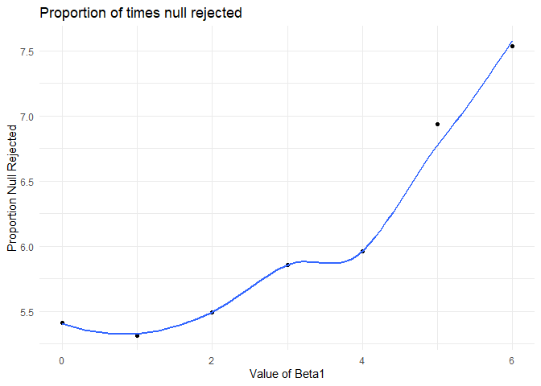
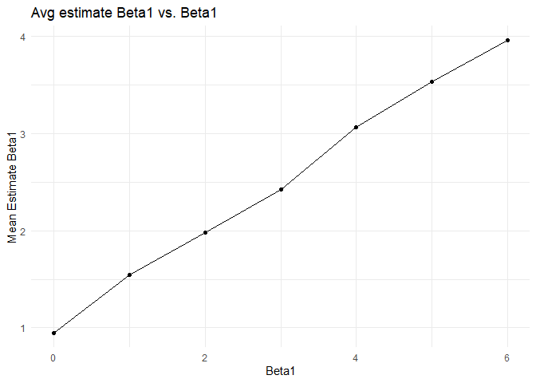

p8105\_hw5\_mss2284
================
Maya Spaur
11/6/2019

``` r
library(tidyverse)
```

    ## -- Attaching packages ------------------------------------------------------------------------------------------ tidyverse 1.2.1 --

    ## v ggplot2 3.2.1     v purrr   0.3.3
    ## v tibble  2.1.3     v dplyr   0.8.3
    ## v tidyr   1.0.0     v stringr 1.4.0
    ## v readr   1.3.1     v forcats 0.4.0

    ## -- Conflicts --------------------------------------------------------------------------------------------- tidyverse_conflicts() --
    ## x dplyr::filter() masks stats::filter()
    ## x dplyr::lag()    masks stats::lag()

``` r
library(ggplot2)
library(ggridges)
```

    ## 
    ## Attaching package: 'ggridges'

    ## The following object is masked from 'package:ggplot2':
    ## 
    ##     scale_discrete_manual

``` r
library(patchwork)
```

\#Problem 1

``` r
set.seed(10)

iris_with_missing = iris %>% 
  map_df(~replace(.x, sample(1:150, 20), NA)) %>%
  mutate(Species = as.character(Species))

head(iris_with_missing, 10)
```

    ## # A tibble: 10 x 5
    ##    Sepal.Length Sepal.Width Petal.Length Petal.Width Species
    ##           <dbl>       <dbl>        <dbl>       <dbl> <chr>  
    ##  1          5.1         3.5          1.4         0.2 setosa 
    ##  2          4.9         3            1.4         0.2 setosa 
    ##  3          4.7         3.2          1.3         0.2 setosa 
    ##  4          4.6         3.1          1.5        NA   setosa 
    ##  5          5           3.6          1.4         0.2 setosa 
    ##  6          5.4         3.9          1.7         0.4 setosa 
    ##  7         NA           3.4          1.4         0.3 setosa 
    ##  8          5           3.4          1.5         0.2 setosa 
    ##  9          4.4         2.9          1.4         0.2 setosa 
    ## 10          4.9         3.1         NA           0.1 setosa

``` r
tail(iris_with_missing, 10)
```

    ## # A tibble: 10 x 5
    ##    Sepal.Length Sepal.Width Petal.Length Petal.Width Species  
    ##           <dbl>       <dbl>        <dbl>       <dbl> <chr>    
    ##  1          6.7         3.1          5.6         2.4 virginica
    ##  2          6.9         3.1          5.1         2.3 virginica
    ##  3         NA           2.7          5.1         1.9 virginica
    ##  4          6.8         3.2         NA           2.3 virginica
    ##  5          6.7         3.3         NA           2.5 virginica
    ##  6          6.7         3            5.2         2.3 virginica
    ##  7          6.3         2.5          5           1.9 <NA>     
    ##  8          6.5         3            5.2         2   <NA>     
    ##  9         NA           3.4          5.4         2.3 virginica
    ## 10          5.9         3            5.1         1.8 virginica

``` r
clean_iris = function(x) {
   if (is.numeric(x)) {
   replace_na(x, mean(x, na.rm = TRUE))
   }
   else if (is.character(x))
     {replace_na(x, "virginica")}
}

output = map_dfr(.x = iris_with_missing, ~ clean_iris(.x))

head(output, 10)
```

    ## # A tibble: 10 x 5
    ##    Sepal.Length Sepal.Width Petal.Length Petal.Width Species
    ##           <dbl>       <dbl>        <dbl>       <dbl> <chr>  
    ##  1         5.1          3.5         1.4         0.2  setosa 
    ##  2         4.9          3           1.4         0.2  setosa 
    ##  3         4.7          3.2         1.3         0.2  setosa 
    ##  4         4.6          3.1         1.5         1.19 setosa 
    ##  5         5            3.6         1.4         0.2  setosa 
    ##  6         5.4          3.9         1.7         0.4  setosa 
    ##  7         5.82         3.4         1.4         0.3  setosa 
    ##  8         5            3.4         1.5         0.2  setosa 
    ##  9         4.4          2.9         1.4         0.2  setosa 
    ## 10         4.9          3.1         3.77        0.1  setosa

``` r
tail(output, 10)
```

    ## # A tibble: 10 x 5
    ##    Sepal.Length Sepal.Width Petal.Length Petal.Width Species  
    ##           <dbl>       <dbl>        <dbl>       <dbl> <chr>    
    ##  1         6.7          3.1         5.6          2.4 virginica
    ##  2         6.9          3.1         5.1          2.3 virginica
    ##  3         5.82         2.7         5.1          1.9 virginica
    ##  4         6.8          3.2         3.77         2.3 virginica
    ##  5         6.7          3.3         3.77         2.5 virginica
    ##  6         6.7          3           5.2          2.3 virginica
    ##  7         6.3          2.5         5            1.9 virginica
    ##  8         6.5          3           5.2          2   virginica
    ##  9         5.82         3.4         5.4          2.3 virginica
    ## 10         5.9          3           5.1          1.8 virginica

As demonstrated by the first 10 rows, the missing numeric variables have
been replaced with the mean of the non-missing values. As shownin the
last 10 rows, the missing character values have been replaced with
“virginica.”

\#Problem 2

``` r
names_data =
  tibble(
  subject = list.files(path="./data")
)

file_path = "./data/"
file_names = file_path %>%
  list.files()

observations_data =
  file_names %>%
  map_dfr(function(file_name){
 
  read_csv(paste0(file_path, file_name))
})
```

    ## Parsed with column specification:
    ## cols(
    ##   week_1 = col_double(),
    ##   week_2 = col_double(),
    ##   week_3 = col_double(),
    ##   week_4 = col_double(),
    ##   week_5 = col_double(),
    ##   week_6 = col_double(),
    ##   week_7 = col_double(),
    ##   week_8 = col_double()
    ## )
    ## Parsed with column specification:
    ## cols(
    ##   week_1 = col_double(),
    ##   week_2 = col_double(),
    ##   week_3 = col_double(),
    ##   week_4 = col_double(),
    ##   week_5 = col_double(),
    ##   week_6 = col_double(),
    ##   week_7 = col_double(),
    ##   week_8 = col_double()
    ## )
    ## Parsed with column specification:
    ## cols(
    ##   week_1 = col_double(),
    ##   week_2 = col_double(),
    ##   week_3 = col_double(),
    ##   week_4 = col_double(),
    ##   week_5 = col_double(),
    ##   week_6 = col_double(),
    ##   week_7 = col_double(),
    ##   week_8 = col_double()
    ## )
    ## Parsed with column specification:
    ## cols(
    ##   week_1 = col_double(),
    ##   week_2 = col_double(),
    ##   week_3 = col_double(),
    ##   week_4 = col_double(),
    ##   week_5 = col_double(),
    ##   week_6 = col_double(),
    ##   week_7 = col_double(),
    ##   week_8 = col_double()
    ## )
    ## Parsed with column specification:
    ## cols(
    ##   week_1 = col_double(),
    ##   week_2 = col_double(),
    ##   week_3 = col_double(),
    ##   week_4 = col_double(),
    ##   week_5 = col_double(),
    ##   week_6 = col_double(),
    ##   week_7 = col_double(),
    ##   week_8 = col_double()
    ## )
    ## Parsed with column specification:
    ## cols(
    ##   week_1 = col_double(),
    ##   week_2 = col_double(),
    ##   week_3 = col_double(),
    ##   week_4 = col_double(),
    ##   week_5 = col_double(),
    ##   week_6 = col_double(),
    ##   week_7 = col_double(),
    ##   week_8 = col_double()
    ## )
    ## Parsed with column specification:
    ## cols(
    ##   week_1 = col_double(),
    ##   week_2 = col_double(),
    ##   week_3 = col_double(),
    ##   week_4 = col_double(),
    ##   week_5 = col_double(),
    ##   week_6 = col_double(),
    ##   week_7 = col_double(),
    ##   week_8 = col_double()
    ## )
    ## Parsed with column specification:
    ## cols(
    ##   week_1 = col_double(),
    ##   week_2 = col_double(),
    ##   week_3 = col_double(),
    ##   week_4 = col_double(),
    ##   week_5 = col_double(),
    ##   week_6 = col_double(),
    ##   week_7 = col_double(),
    ##   week_8 = col_double()
    ## )
    ## Parsed with column specification:
    ## cols(
    ##   week_1 = col_double(),
    ##   week_2 = col_double(),
    ##   week_3 = col_double(),
    ##   week_4 = col_double(),
    ##   week_5 = col_double(),
    ##   week_6 = col_double(),
    ##   week_7 = col_double(),
    ##   week_8 = col_double()
    ## )
    ## Parsed with column specification:
    ## cols(
    ##   week_1 = col_double(),
    ##   week_2 = col_double(),
    ##   week_3 = col_double(),
    ##   week_4 = col_double(),
    ##   week_5 = col_double(),
    ##   week_6 = col_double(),
    ##   week_7 = col_double(),
    ##   week_8 = col_double()
    ## )
    ## Parsed with column specification:
    ## cols(
    ##   week_1 = col_double(),
    ##   week_2 = col_double(),
    ##   week_3 = col_double(),
    ##   week_4 = col_double(),
    ##   week_5 = col_double(),
    ##   week_6 = col_double(),
    ##   week_7 = col_double(),
    ##   week_8 = col_double()
    ## )
    ## Parsed with column specification:
    ## cols(
    ##   week_1 = col_double(),
    ##   week_2 = col_double(),
    ##   week_3 = col_double(),
    ##   week_4 = col_double(),
    ##   week_5 = col_double(),
    ##   week_6 = col_double(),
    ##   week_7 = col_double(),
    ##   week_8 = col_double()
    ## )
    ## Parsed with column specification:
    ## cols(
    ##   week_1 = col_double(),
    ##   week_2 = col_double(),
    ##   week_3 = col_double(),
    ##   week_4 = col_double(),
    ##   week_5 = col_double(),
    ##   week_6 = col_double(),
    ##   week_7 = col_double(),
    ##   week_8 = col_double()
    ## )
    ## Parsed with column specification:
    ## cols(
    ##   week_1 = col_double(),
    ##   week_2 = col_double(),
    ##   week_3 = col_double(),
    ##   week_4 = col_double(),
    ##   week_5 = col_double(),
    ##   week_6 = col_double(),
    ##   week_7 = col_double(),
    ##   week_8 = col_double()
    ## )
    ## Parsed with column specification:
    ## cols(
    ##   week_1 = col_double(),
    ##   week_2 = col_double(),
    ##   week_3 = col_double(),
    ##   week_4 = col_double(),
    ##   week_5 = col_double(),
    ##   week_6 = col_double(),
    ##   week_7 = col_double(),
    ##   week_8 = col_double()
    ## )
    ## Parsed with column specification:
    ## cols(
    ##   week_1 = col_double(),
    ##   week_2 = col_double(),
    ##   week_3 = col_double(),
    ##   week_4 = col_double(),
    ##   week_5 = col_double(),
    ##   week_6 = col_double(),
    ##   week_7 = col_double(),
    ##   week_8 = col_double()
    ## )
    ## Parsed with column specification:
    ## cols(
    ##   week_1 = col_double(),
    ##   week_2 = col_double(),
    ##   week_3 = col_double(),
    ##   week_4 = col_double(),
    ##   week_5 = col_double(),
    ##   week_6 = col_double(),
    ##   week_7 = col_double(),
    ##   week_8 = col_double()
    ## )
    ## Parsed with column specification:
    ## cols(
    ##   week_1 = col_double(),
    ##   week_2 = col_double(),
    ##   week_3 = col_double(),
    ##   week_4 = col_double(),
    ##   week_5 = col_double(),
    ##   week_6 = col_double(),
    ##   week_7 = col_double(),
    ##   week_8 = col_double()
    ## )
    ## Parsed with column specification:
    ## cols(
    ##   week_1 = col_double(),
    ##   week_2 = col_double(),
    ##   week_3 = col_double(),
    ##   week_4 = col_double(),
    ##   week_5 = col_double(),
    ##   week_6 = col_double(),
    ##   week_7 = col_double(),
    ##   week_8 = col_double()
    ## )
    ## Parsed with column specification:
    ## cols(
    ##   week_1 = col_double(),
    ##   week_2 = col_double(),
    ##   week_3 = col_double(),
    ##   week_4 = col_double(),
    ##   week_5 = col_double(),
    ##   week_6 = col_double(),
    ##   week_7 = col_double(),
    ##   week_8 = col_double()
    ## )

``` r
study_data = cbind(names_data, observations_data) %>%
 mutate(subject = str_replace(subject, ".csv", "")) %>%
 pivot_longer(
    week_1:week_8,
    names_to = "week",
    names_prefix = "week_",
    values_to = "observations")
```

``` r
spaghetti_plot = 
  study_data %>%
  ggplot(aes(x = as.numeric(week), y = observations, color = subject)) +
  geom_line() +
  labs(title = "Weekly observations by subject", x = "Week", y = "Observations") + theme(legend.position="bottom")

spaghetti_plot 
```

<!-- -->

Overall differences between the groups include that subjects in the
experimental arm tended to have higher values of weekly observations
than subjects in the control arm. Observations for subjects in the
experimental arm tended to increase as the weeks progressed, whereas
there was greater variation in increasing and decreasing tends for
subjects in the control arm.

\#Problem 3

``` r
sim_regression = function(n = 30, beta0 = 2, beta1 = 0) {
  
  sim_data = tibble(
    x = rnorm(n, mean = 1, sd = 1),
    y = beta0 + beta1 * x + rnorm(n, 0, 50)
  )
  
  ls_fit = lm(y ~ x, data = sim_data) %>%
     broom::tidy() %>%
     select(term, estimate, p.value)
  
}


sim_results = 
  tibble(beta1 = 0:6) %>% 
  mutate(
    output_lists = purrr::map(.x = beta1, ~rerun(10000, sim_regression(beta1 = .x))),
    estimate_dfs = purrr::map(output_lists, bind_rows)) %>% 
  select(-output_lists) %>% 
  unnest(estimate_dfs)
```

\#Plots

Plot 1

``` r
Fig_1 =
sim_results %>%
  group_by(beta1) %>%
  summarize(n = n(),
            prop_sig = sum(p.value < .05)/n()*100) %>%
  ggplot(aes(x = beta1, y = prop_sig)) + geom_point() + geom_smooth(se = FALSE) + labs(x = "Value of Beta1", y = "Proportion Null Rejected")

Fig_1
```

    ## `geom_smooth()` using method = 'loess' and formula 'y ~ x'

<!-- -->

This shows that the association between effect size (Beta1) is overall
positively associated with power (proportion of times the null was
rejected).The relationship is not linear.

Plot 2

``` r
Fig_2 = 
  sim_results %>%
  mutate(average_estimate = mean(estimate)) %>%
  ggplot(aes(x = beta1, y = average_estimate)) + geom_point() + geom_line() + labs(x = "Beta1", y = "Mean Estimate Beta1")

Fig_2
```

<!-- -->

Plot 3

``` r
Fig_3 = 
  sim_results %>%
  filter(p.value < .05) %>%
  mutate(average_estimate = mean(estimate)) %>%
  ggplot(aes(x = beta1, y = average_estimate)) + geom_point() + geom_line() + labs(x = "Beta1", y = "Mean Estimate Beta1")
  
Fig_3
```

<!-- -->

``` r
Fig_2 + Fig_3
```

<!-- -->

The sample average of Beta1 across tests for which the null is rejected
is not approximately equal to the true value of Beta1. As demonstrated
in the table below, the null was rejected a proportion of time for each
beta, leading to a difference in the sample average.

``` r
table = 
  sim_results %>%
  group_by(beta1) %>%
  summarize(n = n(),
            prop_sig = sum(p.value < .05)/n()*100) %>%
  knitr::kable()

table
```

| beta1 |     n | prop\_sig |
| ----: | ----: | --------: |
|     0 | 20000 |     5.410 |
|     1 | 20000 |     5.315 |
|     2 | 20000 |     5.495 |
|     3 | 20000 |     5.855 |
|     4 | 20000 |     5.960 |
|     5 | 20000 |     6.935 |
|     6 | 20000 |     7.535 |
